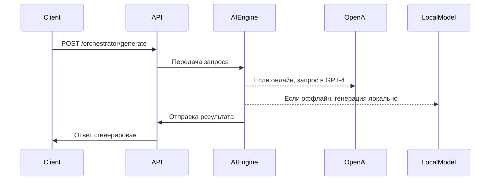

# 🏗 Архитектура проекта

## 1. Архитектурные принципы

Проект "Совет Элронда" строится на гибкости, масштабируемости и автономности. Основные решения:
- Гибридный подход: система работает как с облачными API (GPT-4), так и с локальными моделями (GPT4All).
- Модульная архитектура: каждый компонент выполняет свою задачу.
- Оффлайн-режим: возможность работы без интернета за счет кеширования и локальных моделей.
- Асинхронная обработка: параллельное выполнение запросов для повышения производительности.

## 2. Общий обзор системы

Система состоит из трех уровней:
1. API (FastAPI) — принимает HTTP-запросы, управляет маршрутизацией и обработкой ошибок.
2. Логический уровень (AI Engine) — отвечает за генерацию текста и выбор модели.
3. Инфраструктурный уровень (файловая система, база данных) — хранит логи, кеширует ответы.

### Взаимодействие уровней:
```mermaid
graph TD;
    Client -->|Запрос| API(FastAPI);
    API -->|Перенаправляет| AIEngine;
    AIEngine -->|Если онлайн| OpenAI API;
    AIEngine -->|Если оффлайн| GPT4All;
    AIEngine -->|Логирует| Storage(Локальное хранилище);
    API -->|Ответ| Client;
```

## 3. Модули системы

### API-уровень (FastAPI)
- Обрабатывает входящие HTTP-запросы.
- Делает валидацию данных (Pydantic).
- Выполняет маршрутизацию запросов.

### Логический уровень (AI Engine)
- AI Router — выбирает, использовать OpenAI API или локальную модель.
- Model Manager — управляет загрузкой локальных моделей, распределяет вычислительные ресурсы.
- Response Aggregator — объединяет ответы от нескольких моделей, делает постобработку.

### Инфраструктурный уровень
- Кеширование — локальное хранилище запросов и ответов.
- Логирование — сбор данных о работе системы.
- Файловая система — хранение моделей и конфигурации.

## 4. Поток данных

1. Клиент отправляет HTTP-запрос на `/orchestrator/generate`.
2. FastAPI передаёт запрос в AI Engine.
3. AI Engine выбирает модель (GPT-4 или локальную) и выполняет генерацию.
4. Если модель локальная, её загрузка управляется Model Manager.
5. Response Aggregator форматирует ответ и передаёт API.
6. FastAPI отправляет ответ клиенту.

### Диаграмма последовательностей:


## 5. Безопасность и производительность

- API-ключи хранятся в `.env` и не коммитятся в репозиторий.
- Запросы к API логируются без отображения ключей.
- Данные пользователей и кэшированные ответы хранятся локально.
- Доступ к истории запросов возможен только через интерфейс с аутентификацией.
- Используется асинхронная обработка для одновременного выполнения нескольких задач.
- Поддерживается работа с GPU, если локальная модель поддерживает аппаратное ускорение.
- Архитектура позволяет добавлять новые AI-модели без изменения основной логики.
